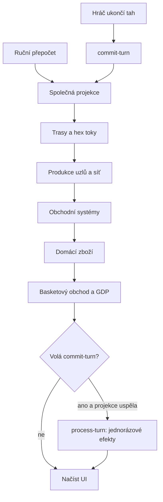

# Chronicle: audit stabilizace a první opravy
Datum: 13. září 2026. Výchozí revize: `97c766b6cad03a021d31be08f65685bbc981430c`.

Opravy byly následně začleněny nad novější `main` (`ee0c15cbd1d5e8618ac885f08a8472c0af5e2c01`), včetně mezitím přidaných změn mapy a parcel. Inventář a odkazy níže popisují výchozí revizi; nové parcelové mechaniky nebyly předmětem podrobného auditu.

## Zhodnocení

Chronicle má použitelný základ, ale několik generací návrhu stále souběžně rozhoduje o stejném stavu. Největší problém není počet panelů: je to nejednotné vlastnictví dat, rozdílné pořadí výpočtů a záměna přepočtu za provedení tahu. To vede k tomu, že opakování stejné akce může změnit výsledek a obrazovka může oznámit úspěch po neúspěšném zápisu.

Repozitář obsahuje 107 adresářů Edge Functions plus společné moduly a 205 SQL migrací. Revize zahrnula inventář vstupních bodů, zápisů ekonomiky a legacy spotřebitelů; podrobně byla prověřena kritická smyčka tah–projekce–ekonomika, obchodní solver, reportování a sestavení. Nejde o ověření každé mechaniky v živé hře. Neměl jsem připojení k administraci nasazené databáze ani neproběhl třicetitahový test na skutečném světě.

Doporučení: nejprve stabilizovat existující hratelnou smyčku a určit vlastníka každé veličiny. Teprve potom odstraňovat staré modely po jednotlivých spotřebitelích. Plošné smazání starých tabulek by nyní poškodilo části aplikace.

## Potvrzené problémy a jejich stav

### 1. P1 — „Jen přepočet“ ve skutečnosti znovu provádí tah — opraveno v první sadě

`recompute-all` po refreshi volal `process-turn` s `recalcOnly: true`. Příznak pouze vyřazoval kontrolu `last_processed_turn`; neblokoval produkci, spotřebu, stavby, morálku ani další efekty. Stisknutí Recompute All tak mohlo měnit zásoby bez posunu času.

Důkaz: [supabase/functions/recompute-all/index.ts](https://github.com/lachim1992/kronika-svet-centrum/blob/97c766b6cad03a021d31be08f65685bbc981430c/supabase/functions/recompute-all/index.ts#L122) a [supabase/functions/process-turn/index.ts](https://github.com/lachim1992/kronika-svet-centrum/blob/97c766b6cad03a021d31be08f65685bbc981430c/supabase/functions/process-turn/index.ts#L187).

Oprava: adaptér pouze přepočítává projekce; `process-turn` nebezpečný příznak odmítá ještě před přístupem do DB. Samostatné dev tlačítko v přehledu říše nyní také volá pouze refresh.

### 2. P1 — Ukončení tahu a ruční refresh mají rozdílné enginy — opraveno v první sadě

`commit-turn` posílal `compute-economy-flow` tělo `{sessionId}`, přestože endpoint přijímá `session_id`. Chyba odpovědi byla ignorována a report obsahoval `ok: true`. Serverový tah navíc vynechával basketový solver; prohlížeč potom spustil vlastní druhý refresh.

Důkaz: [supabase/functions/commit-turn/index.ts](https://github.com/lachim1992/kronika-svet-centrum/blob/97c766b6cad03a021d31be08f65685bbc981430c/supabase/functions/commit-turn/index.ts#L641), [supabase/functions/compute-economy-flow/index.ts](https://github.com/lachim1992/kronika-svet-centrum/blob/97c766b6cad03a021d31be08f65685bbc981430c/supabase/functions/compute-economy-flow/index.ts#L306) a [src/hooks/useNextTurn.ts](https://github.com/lachim1992/kronika-svet-centrum/blob/97c766b6cad03a021d31be08f65685bbc981430c/src/hooks/useNextTurn.ts#L101).

Oprava: společný šestikrokový orchestrátor, stejný kontrakt parametrů, kontrola transportních i aplikačních chyb, zastavení navazujících kroků po selhání. Prohlížeč po tahu pouze načte stav.

Pořadí vychází ze skutečných závislostí: goods solver čte `production_output` a `route_access_factor`, takže výpočet uzlů musí předcházet výrobě zboží. GDP se publikuje až po aktuálních obchodních tocích.

### 3. P1 — Obchodní solver započítává zboží dvakrát a přepisuje historii — opraveno v první sadě

L1 zapisuje `local_supply = auto_supply + bonus_supply`. L2 přičítal auto a bonus znovu. Navíc četl basketové řádky celé session bez omezení na tah a aktualizoval je bez filtru `turn_number`. Historické snapshoty tak mohly vstupovat do dnešního obchodu a být zpětně přepsány.

Důkaz: [supabase/functions/compute-trade-flows/index.ts](https://github.com/lachim1992/kronika-svet-centrum/blob/97c766b6cad03a021d31be08f65685bbc981430c/supabase/functions/compute-trade-flows/index.ts#L690) a [supabase/functions/compute-basket-trade-flows/index.ts](https://github.com/lachim1992/kronika-svet-centrum/blob/97c766b6cad03a021d31be08f65685bbc981430c/supabase/functions/compute-basket-trade-flows/index.ts#L57); zápis [supabase/functions/compute-basket-trade-flows/index.ts](https://github.com/lachim1992/kronika-svet-centrum/blob/97c766b6cad03a021d31be08f65685bbc981430c/supabase/functions/compute-basket-trade-flows/index.ts#L214).

Oprava: výpočet vždy začíná domácím základem `auto_supply + bonus_supply`, pracuje pouze s aktuálním tahem a publikuje nabídku po přičtení importu a odečtení exportu. Při zániku spojení vymaže starý efekt dovozu. Opakovaný výpočet stejného stavu dává stejné toky.

Příklad testu: město má domácí nabídku 4, poptávku 10 a doveze 2. Výsledek je nabídka 6, deficit 4 a uspokojení 60 %, nikoli fiktivních 100 %.

### 4. P1 — Více zapisovatelů fiskálního příjmu — opraveno v první sadě

L2 po každém refreshi přičítal `fiscal_capture` k `goods_wealth_fiscal`, zatímco tahový engine tuto veličinu přepisuje podle daní v6. Makro engine navíc při nulovém fiskálním příjmu sahal po starém `wealth_output`. Nula tedy nebyla respektována jako skutečný výsledek.

Důkaz: [supabase/functions/compute-basket-trade-flows/index.ts](https://github.com/lachim1992/kronika-svet-centrum/blob/97c766b6cad03a021d31be08f65685bbc981430c/supabase/functions/compute-basket-trade-flows/index.ts#L241), [supabase/functions/compute-economy-flow/index.ts](https://github.com/lachim1992/kronika-svet-centrum/blob/97c766b6cad03a021d31be08f65685bbc981430c/supabase/functions/compute-economy-flow/index.ts#L906) a [supabase/functions/process-turn/index.ts](https://github.com/lachim1992/kronika-svet-centrum/blob/97c766b6cad03a021d31be08f65685bbc981430c/supabase/functions/process-turn/index.ts#L861).

Oprava: fiskální komponenty i `total_wealth` zapisuje `process-turn` společně. Refresh neúčtuje daně. `fiscal_capture` zůstává u obchodních toků jako projekce; napojení této alternativní tarifní mechaniky na daně je návrhové rozhodnutí, nikoli další automatický příjem.

### 5. P1 — Úspěšný HTTP požadavek maskuje neúspěšný tah — opraveno na hlavní cestě

Report i smoke harness vyhodnocovaly především HTTP úspěch. Prázdná sada kroků mohla projít; simulace pokračovala po chybě a započítávala neúspěšné pokusy.

Důkaz: [src/components/dev/BetaSmokeHarness.tsx](https://github.com/lachim1992/kronika-svet-centrum/blob/97c766b6cad03a021d31be08f65685bbc981430c/src/components/dev/BetaSmokeHarness.tsx#L82), [src/hooks/useNextTurn.ts](https://github.com/lachim1992/kronika-svet-centrum/blob/97c766b6cad03a021d31be08f65685bbc981430c/src/hooks/useNextTurn.ts#L59) a [src/components/dev/RealSimulationSection.tsx](https://github.com/lachim1992/kronika-svet-centrum/blob/97c766b6cad03a021d31be08f65685bbc981430c/src/components/dev/RealSimulationSection.tsx#L91).

Oprava: kontroly `ok`, chyb fází, dílčích selhání a jednotlivých kroků. Smoke harness kontroluje výsledek serveru a neopravuje ho dalším refreshem. Simulace se při prvním neúspěchu zastaví. Okamžité dvojkliknutí v jednom klientovi blokuje synchronní reference; to nenahrazuje serverový zámek.

### 6. P0 — Zápisové endpointy nemají dostatečnou autorizaci — dosud neopraveno

`commit-turn` a `process-turn` používají service-role klienta bez ověření, že volající smí měnit danou session. `command-dispatch` se pokouší dohledat uživatele, ale neúspěch ověření nevede k odmítnutí a klientem zadaný typ aktéra má privilegované větve. Repo konfigurace vypíná JWT gateway kontrolu u hlavních tahových endpointů.

Důkaz: [supabase/functions/commit-turn/index.ts](https://github.com/lachim1992/kronika-svet-centrum/blob/97c766b6cad03a021d31be08f65685bbc981430c/supabase/functions/commit-turn/index.ts#L43), [supabase/functions/process-turn/index.ts](https://github.com/lachim1992/kronika-svet-centrum/blob/97c766b6cad03a021d31be08f65685bbc981430c/supabase/functions/process-turn/index.ts#L163), [supabase/functions/command-dispatch/index.ts](https://github.com/lachim1992/kronika-svet-centrum/blob/97c766b6cad03a021d31be08f65685bbc981430c/supabase/functions/command-dispatch/index.ts#L64) a [supabase/config.toml](https://github.com/lachim1992/kronika-svet-centrum/blob/97c766b6cad03a021d31be08f65685bbc981430c/supabase/config.toml#L144).

Další oprava: společná autorizace session, identita odvozená z ověřeného tokenu, systémový aktér pouze pro důvěryhodné serverové volání, explicitní kontrola membership/role. Zkontrolovat i skutečné RLS v nasazené DB; stav produkčních politik nebyl ověřen. Neprováděl jsem žádný pokus změnit cizí ani uživatelský živý svět.

### 7. P1 — Tah není atomický a zámek chrání jen část procesu — dosud neopraveno

Existující `world_tick_log` přeskočí pouze fyziku, nikoliv ostatní fáze. Výsledek pokusu o získání zámku se nekontroluje důsledně. Čítač kola se posune ještě před ekonomikou. Dva klienti nebo retry po timeoutu tedy mohou provést části tahu vícekrát nebo ponechat nový tah s nedokončenou ekonomikou.

Důkaz: [supabase/functions/commit-turn/index.ts](https://github.com/lachim1992/kronika-svet-centrum/blob/97c766b6cad03a021d31be08f65685bbc981430c/supabase/functions/commit-turn/index.ts#L80) a [supabase/functions/commit-turn/index.ts](https://github.com/lachim1992/kronika-svet-centrum/blob/97c766b6cad03a021d31be08f65685bbc981430c/supabase/functions/commit-turn/index.ts#L609). `process-turn` kontroluje poslední zpracovaný tah před zápisy, nikoli atomicky s nimi.

První sada selhání nově přizná a neaplikuje ekonomické efekty po neúspěšné projekci. Neřeší obnovu již rozpracovaného tahu ani distribuovanou souběžnost. Další oprava potřebuje per-session zámek, očekávané číslo tahu, per-phase checkpointy a obnovitelné účtování. Při selhání nelze bezpečnost zajistit slepým opakováním celého tahu.

### 8. P1 — Některé projekce mohou tiše zůstat staré — částečně opraveno

Makro výpočet a L2 nyní kontrolují kritické vstupy a zápisy. V goods solveru však další zápisy stále jen logují chybu. Smazání a následné dávkové vkládání navíc netvoří jednu transakci. Inventář se maže jen pro uzly s nenulovým novým výstupem; zastavená výroba může zanechat staré řádky.

Důkaz: [supabase/functions/compute-trade-flows/index.ts](https://github.com/lachim1992/kronika-svet-centrum/blob/97c766b6cad03a021d31be08f65685bbc981430c/supabase/functions/compute-trade-flows/index.ts#L421) a [supabase/functions/compute-trade-flows/index.ts](https://github.com/lachim1992/kronika-svet-centrum/blob/97c766b6cad03a021d31be08f65685bbc981430c/supabase/functions/compute-trade-flows/index.ts#L747).

Další oprava: správně invalidovat nulové výstupy, přestat ignorovat DB chyby a publikovat kompletní snapshot až po úspěšném výpočtu. To je nutné i pro spolehlivou mapu a diagnostické panely.

### 9. P1/P2 — Starý stav zůstává součástí běžného UI — dosud neodstraněno

Dashboard bezpodmínečně volá legacy hook. Žebříčky stále používají `player_resources` a `military_capacity`; admin povrchy obsahují odpovídající editory a mazací cesty. Tvrzení „legacy je opt-in“ tedy neznamená, že už je mimo běžné načtení hry.

Důkaz: [src/pages/Dashboard.tsx](https://github.com/lachim1992/kronika-svet-centrum/blob/97c766b6cad03a021d31be08f65685bbc981430c/src/pages/Dashboard.tsx#L58), [src/hooks/useGameSession.ts](https://github.com/lachim1992/kronika-svet-centrum/blob/97c766b6cad03a021d31be08f65685bbc981430c/src/hooks/useGameSession.ts#L264), [src/components/LeaderboardsPanel.tsx](https://github.com/lachim1992/kronika-svet-centrum/blob/97c766b6cad03a021d31be08f65685bbc981430c/src/components/LeaderboardsPanel.tsx#L7).

Další oprava: převést viditelné spotřebitele na společný read model, odpojit legacy hook z hlavního načítání, teprve pak rušit seedery/editory. Tabulky nyní nemažeme.

### 10. P2 — Daňové UI a popisy pravidel nejsou spolehlivým popisem enginu — dosud neopraveno

`FiscalSubTab` stále vysvětluje starý mix domácí komponenty a market share, ačkoli hlavní výpočet je Lafferiánský model v6. Některé podkomponenty UI dostávají nuly jako kompatibilní aliasy. `fiscalMath.ts` obsahuje vlastní kopii vzorců a jiné měkké prahy než engine.

Důkaz: [src/components/economy/FiscalSubTab.tsx](https://github.com/lachim1992/kronika-svet-centrum/blob/97c766b6cad03a021d31be08f65685bbc981430c/src/components/economy/FiscalSubTab.tsx#L31), [src/lib/fiscalMath.ts](https://github.com/lachim1992/kronika-svet-centrum/blob/97c766b6cad03a021d31be08f65685bbc981430c/src/lib/fiscalMath.ts#L24), [supabase/functions/process-turn/index.ts](https://github.com/lachim1992/kronika-svet-centrum/blob/97c766b6cad03a021d31be08f65685bbc981430c/supabase/functions/process-turn/index.ts#L887).

Další oprava: společné čisté výpočetní funkce pro server a náhled, jasné rozlišení posledního zaúčtovaného příjmu a odhadu po změně daní, vysvětlení zaokrouhlování a skutečných nákladů.

### 11. P2 — Druhá fyzika světa a přetížený obslužný kód — dosud nekonsolidováno

Samostatný `world-tick` a vlastní `runWorldTickEvents` uvnitř `commit-turn` implementují překrývající se fyziku a projekce. `process-tick` je nyní housekeeping; jeho název sám o sobě není důkazem dalšího ekonomického enginu. AI, liga, narativy, diplomacie a další volitelné systémy jsou provázané s velkým orchestrátorem.

Důkaz: [supabase/functions/world-tick/index.ts](https://github.com/lachim1992/kronika-svet-centrum/blob/97c766b6cad03a021d31be08f65685bbc981430c/supabase/functions/world-tick/index.ts#L167), [supabase/functions/commit-turn/index.ts](https://github.com/lachim1992/kronika-svet-centrum/blob/97c766b6cad03a021d31be08f65685bbc981430c/supabase/functions/commit-turn/index.ts#L1352), [supabase/functions/process-tick/index.ts](https://github.com/lachim1992/kronika-svet-centrum/blob/97c766b6cad03a021d31be08f65685bbc981430c/supabase/functions/process-tick/index.ts#L10).

Další oprava: mapovat aktivní volající a spouštěče, vyjmout společnou fyziku do testovatelných funkcí a odpojit volitelné moduly od podmínky úspěšného základního tahu. Neoznačovat komponentu za mrtvou jen proto, že patří starší verzi.

### 12. P2 — Sestavení, výkon a dokumentace

Původní `npm ci` neprošel: package-lock neodpovídal package.json (mj. cloud-auth a XYFlow). Lock je opraven bez změny požadovaných rozsahů závislostí. Přidán CI workflow pro instalaci, TypeScript, testy a build.

Aktuální build má hlavní JS bundle přibližně 2,98 MB před gzipem, 778 kB gzip. Statické importy velkých panelů a diagnostiky snižují přínos některých dynamických importů. To odpovídá těžkopádnosti aplikace, ale není to měření odezvy na skutečném zařízení.

ESLint stále obsahuje rozsáhlý starší dluh (kontrolní běh našel přes 3 200 chyb a 67 upozornění). Plošný úklid není součástí této ekonomické opravy. Starší deprekační dokumenty si místy odporují; jsou označené jako historické, aktuální smyčka je aktualizována.

## Vlastnictví po první sadě

| Veličina / vrstva | Autorita | Co nesmí dělat |
|---|---|---|
| Trasy a geometrie toku | compute-province-routes, compute-hex-flows | Posouvat čas |
| Produkce uzlů a síťové agregáty | compute-economy-flow | Přepisovat fiskální příjem nebo GDP z minulých toků |
| Domácí nabídka zboží | compute-trade-flows | Účtovat státní rezervy |
| Dovoz/vývoz basketů a projekce GDP | compute-basket-trade-flows | Obchodovat s historickými snapshoty nebo přičítat daně při refreshi |
| Daňové komponenty, total_wealth, rezervy | process-turn | Opakovat efekty pod záminkou přepočtu |
| Postup tahu | commit-turn | Spoléhat na opravu z klienta; atomická obnova je stále otevřená |
| Zobrazení a náhled | React read model | Vytvářet paralelní účetní pravdu |
| AI kronika | Narativní projekce | Být autoritou pro mechanický stav |

Rozdíl mezi síťovou kapacitou `total_capacity` a provozní `logistic_capacity` zatím zůstává. Odstraněna byla nefunkční větev, která četla neexistující/nevybranou logistickou kapacitu uzlů; jejich agregace dál používá původní `capacity_score`. Vyvážení těchto dvou veličin není součástí první sady.

## Ověření a hranice

- Čistá instalace `npm ci --ignore-scripts` po opravě locku prošla.
- TypeScript aplikace prošel.
- Prošlo všech 38 testů v 8 souborech, včetně opakování nad novější hlavní větví. Testy pokrývají pořadí enginů, zastavení po chybě, ochranu recalcOnly, zachování skutečného nulového příjmu, opakovaný obchod, historické snapshoty, ztrátu spojení a dvojklik.
- Produkční Vite build prošel; výše uvedená upozornění na velikost zůstávají.
- Lokální Windows sandbox nepovoloval roury nativního esbuildu. Testy/build proto běžely přes stejnou verzi esbuild 0.21.5 ve WebAssembly, přes programatické Vite/Vitest API a bez změny aplikačního kódu kvůli této pomůcce. Do repozitáře se pomocný runtime neukládá. CI používá standardní příkazy.
- Backendové regresní testy spouštějí skutečné Edge handlery s falešnou DB a sítí. Neprokazují správnost nasazeného schématu, RLS, Deno nasazení, souběžných zápisů ani třiceti živých tahů.

## Doporučené pokračování

1. **Oprávnění a bezpečný tah:** autorizace, serverové zámky, ochrana proti opakování, obnova rozpracovaných fází. Dokončeno až když dva souběžné klienty nemohou zdvojit účtování a timeout má jasnou obnovu.
2. **Konzistentní projekce:** odstranit ignorované DB chyby a staré nulové výstupy, publikovat kompletní snapshoty, sjednotit jednotky produkce/kapacity/GDP. Testovat i svět bez měst, přerušené trasy a konec výroby.
3. **Jeden ekonomický pohled:** převést žebříčky a běžné panely, sdílet daňové vzorce, odstranit legacy načítání. Každé viditelné číslo musí mít dohledatelný původ.
4. **Jedna fyzika a menší hráčské UI:** zkonsolidovat aktivní tick cesty, volitelné moduly načítat až při otevření, oddělit dev povrchy a ověřit mobilní mapu.
5. **Řízené vyřazení starých verzí:** až po převodu posledního readeru, writeru a seed cesty. Zachovat převodní cestu pro existující světy; žádné hromadné mazání dat naslepo.

První sada je návrh oprav k revizi, nikoli tvrzení, že je celá hra hotová. Před nasazením se musí společně nasadit změněné Edge Functions a teprve potom klient bez dodatečného refreshování. Ověření 30 tahů patří do odděleného testovacího světa.
